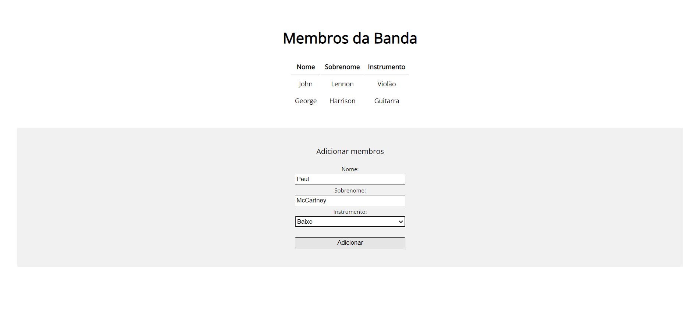
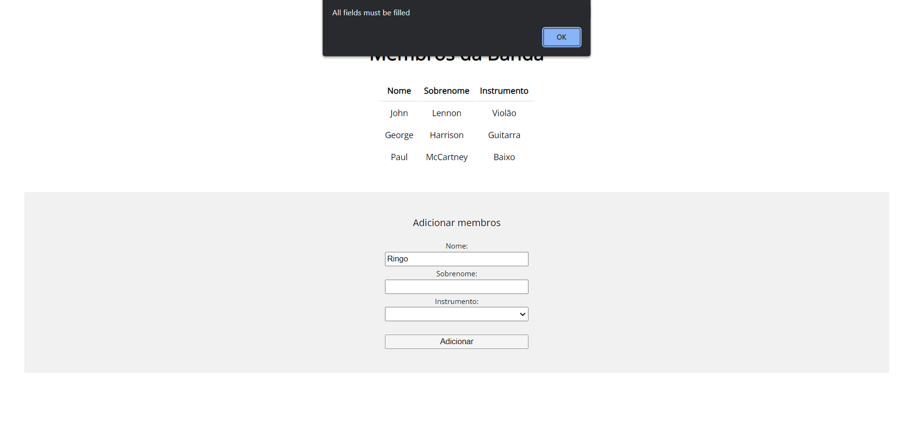

# Simple Band Members List em Vue.js

- Implementação simples de *Lista de Membros de Banda* para estudo de Vue.js com Javascript
- Vue inserido no projeto pelo CDN
- Os dados utilizados nesse projeto são fictícios e apenas para fins de estudo

## Descrição

- É mostrada a lista com os membros já adicionados e seus isntrumentos
- É necessário preencher os dados do novo membro e clicar Adicionar para incluí-lo na lista
- Não é permitido adicionar membro se algum dado estiver faltando.
- Segue abaixo screenshots das views:

 

